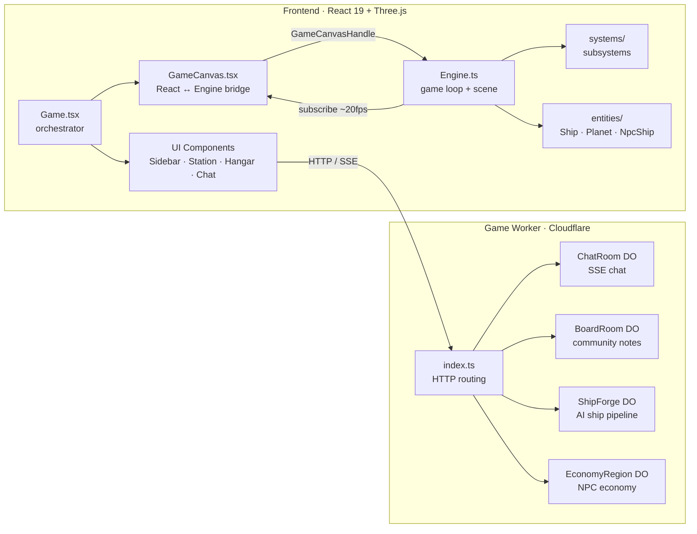
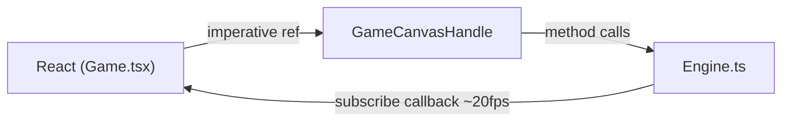

# EV · 2090

LIVE DEMO: https://ev2090.com/

A 3D space simulation game built with React and Three.js, deployed on Cloudflare.

> **Read-only repository.** This is the first public release of EV · 2090. I'm still figuring out the best workflow for collaborating with other developers without spending all my time managing PRs and maintaining two parallel codebases (the MMO branch I actively build on vs. a contributor-friendly fork). For now, **treat this repo as read-only** — explore it, learn from it, and use it as a starting point for your own multiplayer engine, single-player variant, or backend experiments. When I've sorted out a contribution workflow that doesn't slow down development, I'll open things up. Stay tuned.

## What is this?

EV · 2090 is a 3D space simulation built with **React 19** for UI, **Three.js** for the 3D world, and **Cloudflare Workers** for the backend. You fly a ship around a solar system, scan NPC vessels, dock at planet stations to trade commodities, swap between ship models and colors, and chat with other players in real time.

Behind the scenes, a living economy simulates production, consumption, and NPC trade routes 24/7 -- whether players are online or not. An AI-powered ship forge lets the community design new vessels. An MCP server lets you manage the whole economy by talking to Claude. And an admin dashboard gives you a 3D visualization of every trade route and market in the system.

The codebase spans four workspaces with a regular structure. Every engine system follows the same pattern. Every Durable Object follows the same pattern. Once you understand one, you understand them all.

## Documentation

You do not need to read everything. Pick the guide that matches what you are working on.

### Start here
- **[Architecture](docs/architecture.md)** -- big picture, key diagrams, data flow
- **[AI Guide](docs/ai.md)** -- using AI coding assistants with this codebase

### Frontend
- **[Engine Guide](docs/engine-guide.md)** -- 3D layer: systems, entities, game loop, shaders
- **[UI Guide](docs/ui-guide.md)** -- React components: sidebar, station, hangar, responsive design

### Backend
- **[Backend Guide](docs/backend-guide.md)** -- Backend Worker, Durable Objects, routing
- **[Economy Engine](docs/economy-engine.md)** -- tick engine, SQLite schema, price curves, warmup
- **[NPC Economy](docs/npc-economy.md)** -- NPC hauler brain, trade routes, sawtooth patterns

### Extra Tools
- **[Ship Forge](docs/forge-guide.md)** -- Ship Creation pipeline
- **[Admin Guide](docs/admin-guide.md)** -- admin dashboard (economy monitoring)
- **[MCP Guide](docs/mcp-guide.md)** -- MCP server, AI-assisted economy management

### Deployment & tooling
- **[Cloudflare Setup](docs/cloudflare-setup.md)** -- deploying your own instance from scratch
- **[Self-Hosting](docs/self-hosting.md)** -- running without Cloudflare (workerd, Docker, VPS)
- **[Dev Tools](docs/dev-tools.md)** -- config panel, debug commands, authoring tools
- **[Recipes](docs/recipes.md)** -- how to add systems, entities, components, routes (Warning; untested)
- **[Security](docs/security.md)** -- security model, keys, CORS, rate limiting


## Tech Stack

| Layer     | Technology                     | Version |
| --------- | ------------------------------ | ------- |
| UI        | React                          | 19      |
| 3D Engine | Three.js                       | 0.172   |
| Language  | TypeScript                     | 5.7     |
| Bundler   | Vite                           | 6       |
| Backend   | Cloudflare Workers + Durable Objects | -  |
| Hosting   | Cloudflare Pages               | -       |

## The stack at a glance

```
┌──────────────────────────────────────────────────────────┐
│  Frontend (React 19 + Three.js)    ← you fly ships here │
│  Vite 6 · TypeScript 5.7 · port 5180                    │
├──────────────────────────────────────────────────────────┤
│  Admin Dashboard (React 19 + Three.js)    ← economy ops │
│  Vite 6 · port 5181                                     │
├──────────────────────────────────────────────────────────┤
│  Game Worker (Cloudflare Workers)     ← the brain        │
│  4 Durable Objects · 2 R2 buckets · 1 queue              │
├──────────────────────────────────────────────────────────┤
│  MCP Worker (Cloudflare Workers)      ← AI interface     │
│  37 tools · OAuth 2.0 · Claude integration               │
└──────────────────────────────────────────────────────────┘
```

## Getting Started

Two commands. That's it.

```bash
npm install
npm run dev
```

`npm install` sets up all four workspaces. `npm run dev` starts the frontend, the local worker, and the admin dashboard — and **automatically seeds the NPC economy after 8 seconds** so you have live trade data from the moment the page loads. No API keys, no `.env` files, no Cloudflare account required.

| URL | What's there |
|-----|-------------|
| `http://localhost:5180` | The game — fly ships, dock, trade |
| `http://localhost:5181` | Admin dashboard — 3D trade route viewer, economy overview |
| `http://localhost:8787` | Local worker API |

The game runs in **no-auth mode** by default: all admin routes are open and the economy is fully functional with locally seeded data. You can explore the entire game engine without touching any configuration.

Advanced configuration (AI ship forge, custom API keys, deploying your own Cloudflare infrastructure) is covered in [CLAUDE.md](CLAUDE.md) and [docs/cloudflare-setup.md](docs/cloudflare-setup.md) when you're ready for it.

### Prerequisites

- Node.js 18+

### Run independently

```bash
npm run dev:frontend   # frontend only — API proxied to production ws.ev2090.com
npm run dev:api        # local worker only
npm run dev:admin      # admin dashboard only
```

### Deploy

```bash
npm run deploy         # builds + deploys frontend to Cloudflare Pages
npm run deploy:api     # deploys worker to Cloudflare Workers
```

## Controls

| Key             | Action  |
|-----------------|---------|
| W / Arrow Up    | Thrust  |
| A / Arrow Left  | Rotate left  |
| D / Arrow Right | Rotate right |
| S / Arrow Down  | Brake   |
| B               | Toggle debug beam |

**Console tricks** -- open your browser dev tools and try:

| Command | Action |
|---------|--------|
| `config()` | Toggle light/camera debug panel |
| `testship()` | Spawn a frozen NPC near your ship |
| `heroshot()` | Toggle hero shot authoring tool |
| `hardpoints()` | Toggle hardpoint editor |
| `forge()` | Toggle ship forge overlay |
| `ship("bob")` | Switch ship by catalog ID |
| `zoom(0.3)` | Zoom camera (lower = closer) |
| `zoomreset()` | Reset zoom to default |
| `reset()` | Clear localStorage and reload |

**URL shortcuts** (dev only):

`?scene=gameplay` · `?scene=docked` · `?scene=heroshot` · `?scene=hardpoint` · `?scene=config` · `?scene=intro`

## Architecture Overview



The frontend is a single-page app. The Three.js engine runs the 3D scene independently of React. React handles the HUD, sidebar panels, station UI, hangar, and chat. The engine pushes state updates to React at ~20fps via a subscribe callback.

The worker is a Cloudflare Worker with four Durable Objects: ChatRoom (real-time SSE chat), BoardRoom (community notes), ShipForge (AI-powered ship generation), and EconomyRegionDO (NPC economy simulation with SQLite). Two R2 buckets store ship models and economy snapshots.

## The one rule that governs everything

> **The engine has zero React dependencies. React talks to the engine through an imperative ref handle (`GameCanvasHandle`). The engine pushes state back to React at ~20 fps via a subscribe callback. This boundary is the single most important thing to understand.**

The flow looks like this:



React never reaches into Three.js objects directly. The engine never imports React. `GameCanvasHandle` is the contract between the two worlds. If you remember nothing else from these docs, remember this.

## The four backend patterns

The backend follows the same principle -- a small number of repeating patterns:

1. **Every Durable Object** follows: constructor loads state → `fetch()` handles routes → `alarm()` for periodic work.
2. **Every MCP tool** follows: validate scope → extract params → call DO or R2 → format response.
3. **Every admin endpoint** follows: validate Bearer token → call DO → return JSON.
4. **All state** is dual: in-memory (fast) + SQLite/R2 (durable). Always update both.


## AI-Assisted Development

Use an AI coding assistant? I've prepared project context files:

- **[CLAUDE.md](CLAUDE.md)** — for Claude Code. Loaded automatically when you open this project.
- **[.cursorrules](.cursorrules)** — for Cursor. Loaded automatically as project rules.
- **[docs/ai.md](docs/ai.md)** — explains what these files contain and why every rule exists.

These files contain architecture rules, conventions, common tasks, and gotchas so your AI assistant understands the codebase from the first prompt.

## Project Structure

```
escape_velocity/
├── frontend/                       # React + Three.js SPA
│   ├── src/
│   │   ├── components/             # React UI components
│   │   │   ├── config/             # CollapsibleSection building blocks
│   │   │   ├── sidebar/            # Right sidebar panels (Radar, Diagnostic, Selector, Cargo, Status, Nav, Target)
│   │   │   ├── station/            # Station facility sub-panels (Summary, Trading, Locked)
│   │   │   ├── hangar/             # Ship management overlay (HangarOverlay, ShipCard, ShipDetail, ForgeCreatePanel)
│   │   │   ├── Game.tsx            # Main layout orchestrator
│   │   │   ├── GameCanvas.tsx      # Three.js canvas + React bridge
│   │   │   ├── IntroScreen.tsx     # First-time ship selection
│   │   │   ├── StationPanel.tsx    # Desktop docking interface
│   │   │   ├── StationOverlay.tsx  # Mobile docking interface (CRT terminal)
│   │   │   ├── ChatPanel.tsx       # Multiplayer SSE chat
│   │   │   └── ...                 # DockFlash, TouchControls, hangar/, etc.
│   │   ├── engine/                 # Three.js game engine (no React deps)
│   │   │   ├── Engine.ts           # Core: game loop, scene, renderer
│   │   │   ├── ShipCatalog.ts      # Ship definitions (11 built-in + community)
│   │   │   ├── entities/           # Ship, Planet, NpcShip, Bridge
│   │   │   ├── systems/            # CameraController, NpcManager, PostProcessing, etc.
│   │   │   └── shaders/            # GLSL shaders (shield, vignette, color correction)
│   │   ├── data/                   # Static game data (stations, missions)
│   │   ├── hooks/                  # useBreakpoint, useConfigSlider, usePlayerEconomy, useMarketPrices
│   │   └── types/                  # Shared TypeScript interfaces
│   └── vite.config.ts
├── worker/                         # Cloudflare Worker (game backend)
│   ├── src/
│   │   ├── index.ts                # HTTP routing + CORS + queue consumer
│   │   ├── admin.ts                # Admin API handlers (Bearer auth)
│   │   ├── chat-room.ts            # ChatRoom DO (SSE chat)
│   │   ├── board-room.ts           # BoardRoom DO (community notes)
│   │   ├── ship-forge.ts           # ShipForge DO (AI ship pipeline)
│   │   ├── economy-region.ts       # EconomyRegionDO (NPC economy, SQLite)
│   │   ├── economy/                # Pricing, trade routes, disruptions
│   │   └── data/                   # Commodity + planet definitions
│   └── wrangler.toml
├── worker-mcp/                     # MCP server (AI economy management)
│   └── src/tools/                  # 37 tools across 10 categories
├── admin/                          # Admin dashboard (local dev only)
│   └── src/                        # Economy monitoring + 3D trade viewer
├── docs/                           # Project documentation
└── package.json                    # Monorepo root (workspaces)
```

## Environment Variables

| Variable | Description |
|----------|-------------|
| `VITE_API_PROXY_TARGET` | Override API proxy target in dev. Defaults to `https://ws.ev2090.com`. |
| `VITE_FORGE_API_KEY` | Ship Forge admin key for local dev. |

## Shared Infrastructure

The project ships with hardcoded URLs pointing to `cdn.ev2090.com` (assets) and `ws.ev2090.com` (API backend). These are provided temporarily so you can clone the repo and play immediately without deploying your own infrastructure. **They will likely be shut down in the future** — don't depend on them for a fork. To deploy your own instance, see [docs/cloudflare-setup.md](docs/cloudflare-setup.md).

## Credits

The ship models in this project are by [**@Quaternius**](https://quaternius.com), released under [CC0 1.0 Universal (Public Domain)](https://creativecommons.org/publicdomain/zero/1.0/). These models are incredible and free — if you use them in your own projects, consider supporting Quaternius on Patreon. Even $1 helps.

**→ [patreon.com/quaternius](https://www.patreon.com/quaternius)**

## Roadmap

EV · 2090 is built on React and TypeScript — which means it can ship everywhere. I'm working toward releasing the framework with native builds for:

- **Web** (current) — runs in any modern browser
- **Desktop** — Windows and macOS executables via Electron or Tauri
- **Mobile** — iOS and Android via Capacitor or React Native

One codebase, every platform. Stay tuned.

## License

This project is licensed under the [MIT License](LICENSE).
