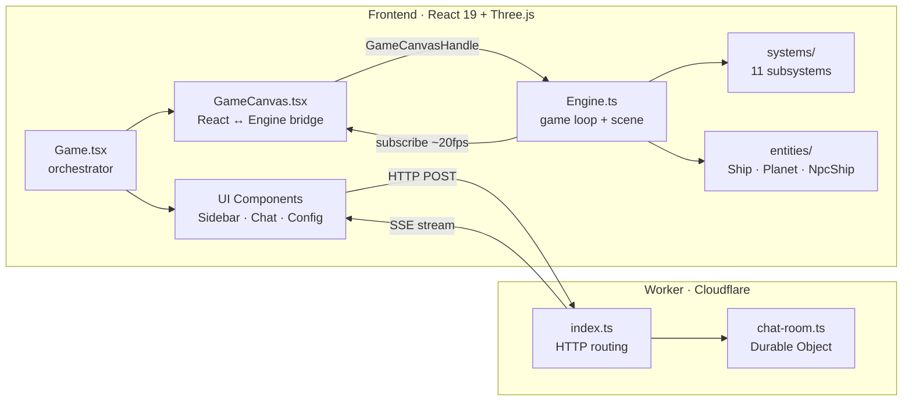

# EV · 2090

LIVE DEMO: https://ev2090.com/

A 3D space simulation game built with React and Three.js, deployed on Cloudflare.

> **Read-only repository.** This is the first public release of EV · 2090. I'm still figuring out the best workflow for collaborating with other developers without spending all my time managing PRs and maintaining two parallel codebases (the MMO branch I actively build on vs. a contributor-friendly fork). For now, **treat this repo as read-only** — explore it, learn from it, and use it as a starting point for your own multiplayer engine, single-player variant, or backend experiments. When I've sorted out a contribution workflow that doesn't slow down development, I'll open things up. Stay tuned.

## Tech Stack

| Layer     | Technology                     | Version |
| --------- | ------------------------------ | ------- |
| UI        | React                          | 19      |
| 3D Engine | Three.js                       | 0.172   |
| Language  | TypeScript                     | 5.7     |
| Bundler   | Vite                           | 6       |
| Backend   | Cloudflare Workers + Durable Objects | -  |
| Hosting   | Cloudflare Pages               | -       |

## Getting Started

### Prerequisites

- Node.js 18+

### Install

```bash
npm install
```

This installs all workspace dependencies (frontend + worker).

### Development

```bash
npm run dev
```

Starts both services concurrently:
- **Frontend** on `http://localhost:5180`
- **Worker** on `http://localhost:8787`

You can also run them independently:

```bash
npm run dev:frontend   # frontend only
npm run dev:api        # worker only
```

### Deploy

```bash
npm run deploy         # builds + deploys frontend to Cloudflare Pages
npm run deploy:api     # deploys worker to Cloudflare Workers
```

## Architecture Overview 



The frontend is a single-page app. The Three.js engine runs the 3D scene independently of React. React handles the HUD, sidebar panels, chat, and config UI. The engine pushes state updates to React at ~20fps via a subscribe callback.

The worker is a Cloudflare Worker with a Durable Object (`ChatRoom`) that handles multiplayer chat. The frontend connects via SSE (Server-Sent Events) for real-time message streaming and sends messages over HTTP POST.

## Documentation

New to the project? Start here:

| Guide | What you'll learn |
|-------|-------------------|
| [Welcome](docs/welcome.md) | Project overview, how to run it, reading order |
| [Architecture](docs/architecture.md) | Mermaid diagrams, React↔Engine boundary, data flows |
| [Engine Guide](docs/engine-guide.md) | 3D layer: 11 subsystems, 3 entities, game loop, shaders |
| [UI Guide](docs/ui-guide.md) | React components, config panel, responsive design, CSS |
| [Backend Guide](docs/backend-guide.md) | Cloudflare Worker, Durable Object, SSE chat |
| [AI Guide](docs/ai.md) | What `CLAUDE.md` and `.cursorrules` are, and why every rule exists |

## AI-Assisted Development

Use an AI coding assistant? I've prepared project context files:

- **[CLAUDE.md](CLAUDE.md)** — for Claude Code. Loaded automatically when you open this project.
- **[.cursorrules](.cursorrules)** — for Cursor. Loaded automatically as project rules.
- **[docs/ai.md](docs/ai.md)** — explains what these files contain and why every rule exists.

These files contain architecture rules, conventions, common tasks, and gotchas so your AI assistant understands the codebase from the first prompt.

## Project Structure

```
escape_velocity/
├── frontend/                       # React + Three.js SPA
│   ├── src/
│   │   ├── components/             # React UI components
│   │   │   ├── config/             # Config panel building blocks
│   │   │   │   ├── CollapsibleSection.tsx
│   │   │   │   └── CollapsibleSection.css
│   │   │   ├── sidebar/            # Right sidebar panels
│   │   │   │   ├── Sidebar.tsx             # Container with responsive layout
│   │   │   │   ├── RadarPanel.tsx          # SVG radar scanner
│   │   │   │   ├── ShipDiagnosticPanel.tsx # Ship wireframe + stats
│   │   │   │   ├── ShipSelectorPanel.tsx   # Ship picker
│   │   │   │   ├── ShipStatusPanel.tsx     # Hull/shield/fuel bars
│   │   │   │   ├── TargetPanel.tsx         # Target info
│   │   │   │   ├── NavigationPanel.tsx     # Nav coordinates
│   │   │   │   ├── sidebar.css
│   │   │   │   ├── radar.css
│   │   │   │   └── diagnostic.css
│   │   │   ├── Game.tsx                # Main layout orchestrator
│   │   │   ├── GameCanvas.tsx          # Three.js canvas + React bridge
│   │   │   ├── LightDebugPanel.tsx     # Config UI (lights, shield, camera)
│   │   │   ├── LightDebugPanel.css
│   │   │   ├── ChatPanel.tsx           # Multiplayer chat (SSE)
│   │   │   ├── ChatPanel.css
│   │   │   ├── NicknameEditor.tsx      # Player name input
│   │   │   ├── NicknameEditor.css
│   │   │   ├── OffscreenIndicators.tsx # Direction arrows for offscreen objects
│   │   │   ├── OffscreenIndicators.css
│   │   │   ├── TouchControls.tsx       # Mobile joystick
│   │   │   └── TouchControls.css
│   │   ├── engine/                  # Three.js game engine (no React deps)
│   │   │   ├── Engine.ts               # Core: game loop, scene, renderer
│   │   │   ├── ShipCatalog.ts          # Ship definitions (5 ships)
│   │   │   ├── entities/               # Game objects
│   │   │   │   ├── Ship.ts             # Player ship (physics, mesh, shield)
│   │   │   │   ├── Planet.ts           # Procedural planets
│   │   │   │   └── NpcShip.ts          # AI ships (state machine + shield)
│   │   │   ├── systems/                # Engine subsystems
│   │   │   │   ├── LightingSetup.ts    # Scene lighting (5 lights)
│   │   │   │   ├── NpcManager.ts       # NPC spawning + scanner detection
│   │   │   │   ├── DebugBeam.ts        # Debug beam visualization
│   │   │   │   ├── OrbitControls.ts    # Orbit camera mouse controls
│   │   │   │   ├── CameraController.ts # Camera modes (ortho + debug)
│   │   │   │   ├── InputManager.ts     # Keyboard/pointer input
│   │   │   │   ├── ModelCache.ts       # GLTF model + texture caching
│   │   │   │   ├── NebulaBg.ts         # Procedural nebula background
│   │   │   │   ├── PlanetTextureGen.ts # Procedural planet textures
│   │   │   │   ├── SoundManager.ts     # Audio playback
│   │   │   │   └── Starfield.ts        # Static star background
│   │   │   └── shaders/
│   │   │       └── shield.glsl.ts      # Fresnel shield GLSL shaders
│   │   ├── hooks/
│   │   │   ├── useBreakpoint.ts        # Responsive breakpoint hook
│   │   │   └── useConfigSlider.ts      # Config panel slider hook
│   │   ├── types/
│   │   │   └── game.ts                 # Shared type definitions
│   │   ├── App.tsx                     # Root component
│   │   ├── App.css                     # Global layout styles
│   │   ├── responsive.css              # All media queries
│   │   ├── index.css                   # Base CSS reset
│   │   ├── main.tsx                    # Entry point
│   │   └── vite-env.d.ts              # Vite type declarations
│   ├── vite.config.ts                  # Vite config (port, proxy, aliases)
│   └── package.json
├── worker/                         # Cloudflare Worker (chat backend)
│   ├── src/
│   │   ├── index.ts                # HTTP routing + CORS
│   │   └── chat-room.ts           # Durable Object for chat state
│   ├── wrangler.toml               # Worker config
│   └── package.json
└── package.json                    # Monorepo root (concurrently)
```

## Environment Variables

| Variable             | Description                                                                 |
| -------------------- | --------------------------------------------------------------------------- |
| `VITE_CHAT_API_URL`  | Override chat API URL. Defaults to `/api/chat` in dev, `https://ws.ev2090.com/api/chat` in prod. |

## Shared Infrastructure

The project ships with hardcoded URLs pointing to `cdn.ev2090.com` (assets) and `ws.ev2090.com` (chat backend). These are provided temporarily so you can clone the repo and play immediately without deploying your own infrastructure. **They will likely be shut down in the future** — don't depend on them for a fork or derivative project. To point at your own services, set the `VITE_CHAT_API_URL` environment variable and update the CDN references in the engine source.

## Dev Tips

- Type `config()` in the browser console to toggle the Config panel.
- Type `testship()` to spawn a test NPC.
- Press `B` to toggle the debug beam.
- The Config panel has a **COPY CONFIG** button to export all current settings as JSON.
- The Vite dev server proxies `/api/chat` to the production worker, so chat works in local development without running the worker.

## Credits

The ship models in this project are by [**@Quaternius**](https://quaternius.com), released under [CC0 1.0 Universal (Public Domain)](https://creativecommons.org/publicdomain/zero/1.0/). These models are incredible and free — if you use them in your own projects, consider supporting Quaternius on Patreon. Even $1 helps.

**→ [patreon.com/quaternius](https://www.patreon.com/quaternius)**

## Roadmap

EV · 2090 is built on React and TypeScript — which means it can ship everywhere. I'm working toward releasing the framework with native builds for:

- **Web** (current) — runs in any modern browser
- **Desktop** — Windows and macOS executables via Electron or Tauri
- **Mobile** — iOS and Android via Capacitor or React Native

One codebase, every platform. Stay tuned.

## License

This project is licensed under the [MIT License](LICENSE).
