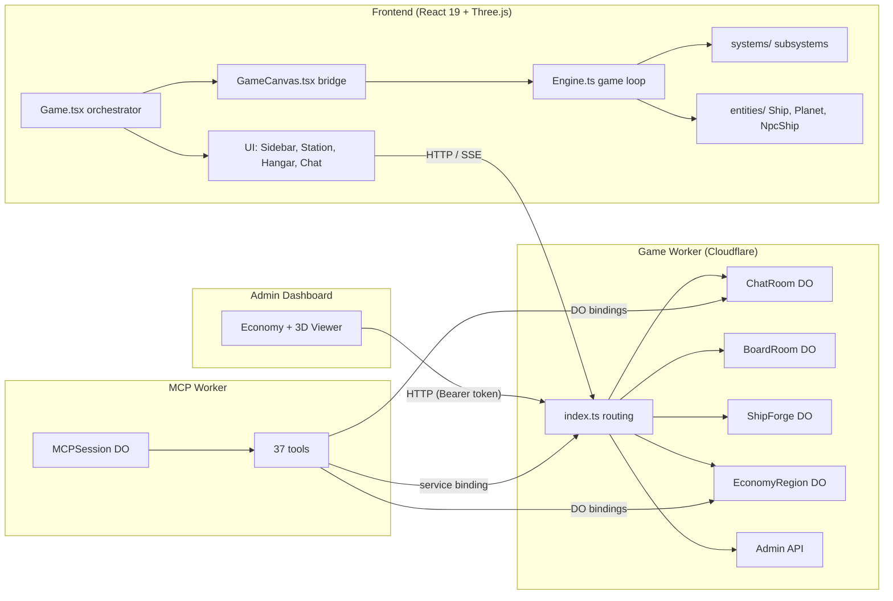
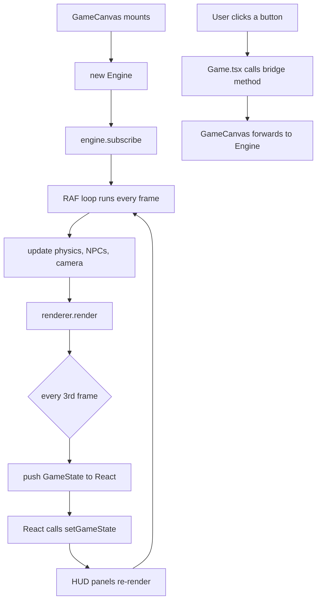
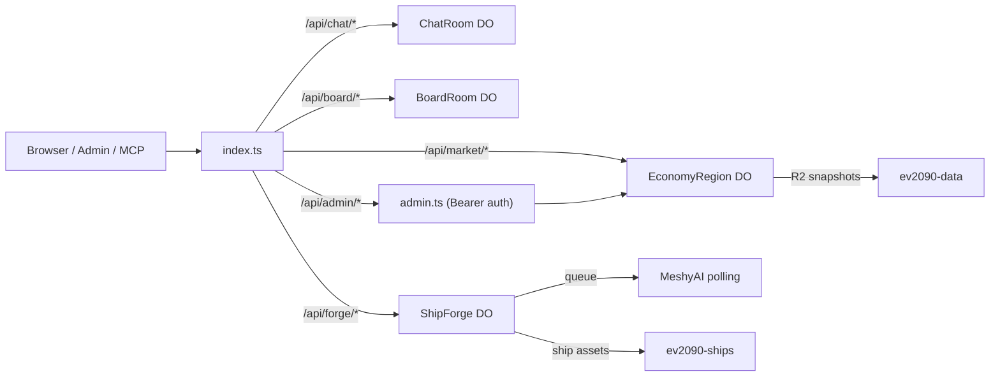
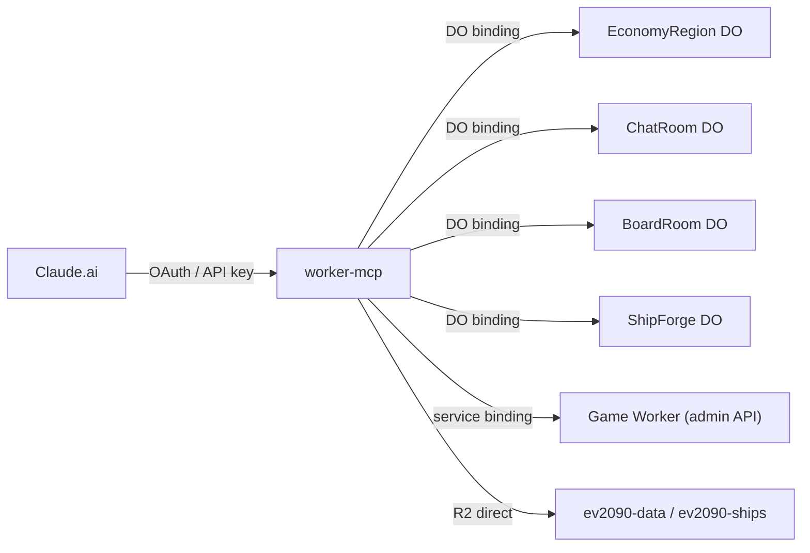
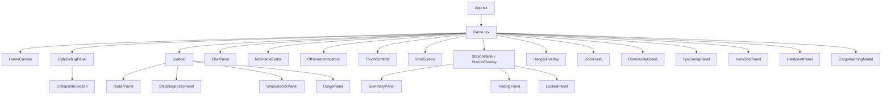
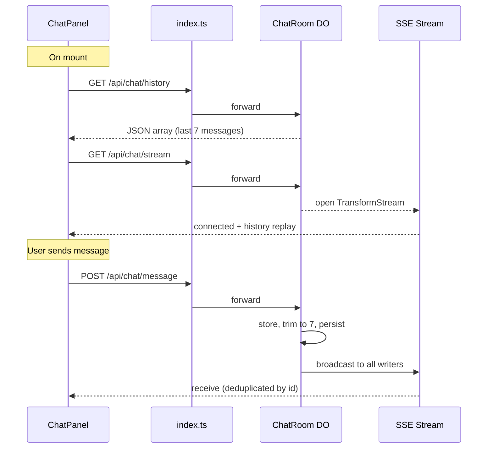
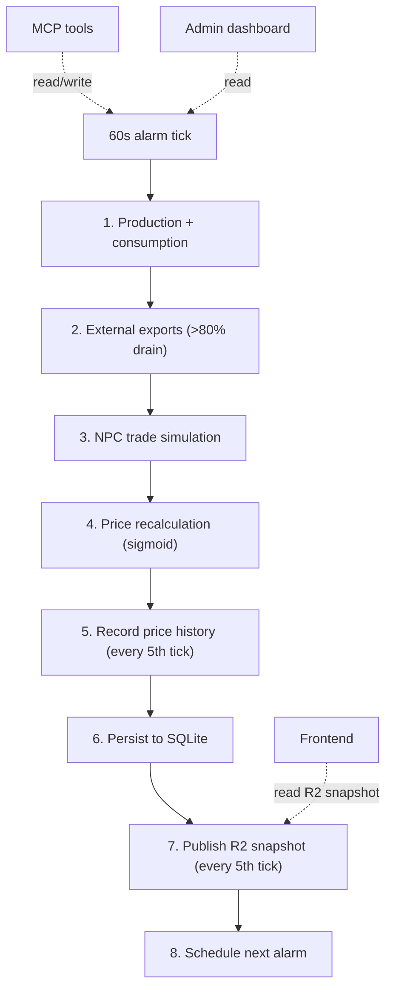

[← Back to index](/README.md)

# Architecture

This document is the centerpiece of the EV · 2090 documentation. It covers the high-level structure, the critical React-Engine boundary, the backend Durable Objects, and the data flows that tie everything together.

## High-level overview

The project is split into four units: a Vite-powered React frontend (the game), an admin dashboard (local dev tool only — not hardened for public deployment), a Cloudflare Worker backend (the brain), and an MCP server (the AI interface). They communicate over HTTP, SSE, and WebSocket.

---

## The React-Engine boundary

This is the single most important architectural concept in the project. The engine (Three.js) and React live in completely separate worlds. They never import each other. The bridge between them is the `GameCanvasHandle` interface, exposed via React's `useImperativeHandle`.

**How it works:**

1. `Game.tsx` renders `<GameCanvas ref={canvasRef} />`.
2. Inside `GameCanvas`, a `useEffect` creates a new `Engine` instance and calls `engine.subscribe(onStateUpdate)`.
3. The engine runs its own `requestAnimationFrame` loop. Every 3rd frame (~20 fps), it calls the subscribe callback with a fresh `GameState` snapshot.
4. `GameCanvas` forwards that snapshot to `Game.tsx` via the `onStateUpdate` prop, which calls `setGameState(state)`.
5. React re-renders the HUD panels with the new data.
6. When the user clicks a button (change ship, dock, trade, etc.), `Game.tsx` calls methods on `canvasRef.current` -- the imperative handle. Those methods forward directly to the engine.

---

## GameCanvasHandle -- the bridge API

This is the **only** way React sends commands to the engine. Every method on this interface maps one-to-one to an `Engine` method. The handle is defined in `GameCanvas.tsx` via `useImperativeHandle`.

### Ship commands

| Method | Description |
|--------|-------------|
| `changeShip(shipId)` | Swap to a different ship model (preserves position and velocity) |
| `changeShipColor(color)` | Change the ship's texture color |
| `jumpBack()` | Teleport to the nearest planet |
| `setSidebarWidthPx(px)` | Tell the engine the sidebar pixel width so the camera centers the ship |
| `enterDock(planet)` | Initiate docking sequence at a planet |
| `exitDock()` | Undock and resume gameplay |

### Camera commands

| Method | Description |
|--------|-------------|
| `setZoom(factor)` | Set camera zoom level |
| `getZoom()` | Read current zoom |
| `setCameraOffset(x, y)` | Set manual camera offset |
| `getCameraOffset()` | Read current camera offset |

### Debug commands

| Method | Description |
|--------|-------------|
| `setDebugView(view)` | Switch camera mode: `"normal"`, `"side"`, `"iso"`, `"orbit"`, `"fpv"` |
| `getDebugView()` | Read current camera mode |
| `setBeamVisible(visible)` | Show or hide the scan beam line |
| `spawnTestShip()` | Spawn a frozen NPC near the player |
| `spawnTestRing()` | Spawn 4 test ships in a ring around the player |
| `clearTestShips()` | Remove all test ships |

### Config queries

| Method | Description |
|--------|-------------|
| `getLightConfig()` | Read current lighting setup for the debug panel |
| `updateLight(lightName, property, value)` | Tweak a light property in real time |
| `updateShipMaterial(property, value)` | Tweak ship material properties |

---

## Engine internals overview

The `Engine` constructor creates the Three.js scene and wires up all subsystems. Everything is instantiated in the constructor and disposed together in `dispose()`.

```mermaid
graph TB
    Engine["Engine.ts"] --> Renderer["WebGLRenderer"]
    Engine --> Scene["THREE.Scene"]
    Engine --> CC["CameraController"]
    Engine --> Input["InputManager"]
    Engine --> Star["Starfield"]
    Engine --> Neb["NebulaBg"]
    Engine --> Ship["Ship (player)"]
    Engine --> Planets["Planet[] (4)"]
    Engine --> Light["LightingSetup"]
    Engine --> NPC["NpcManager"]
    Engine --> Beam["DebugBeam"]
    Engine --> Orbit["OrbitControls"]
    Engine --> Sound["SoundManager"]
    Engine --> Models["ModelCache"]
    Engine --> PlanetTex["PlanetTextureGen"]
    Engine --> PostFx["PostProcessing"]
    Engine --> Hero["HeroCamera"]
    Engine --> HardEd["HardpointEditor"]
```

### The four planets

| Name   | Radius | Economy Type | Atmosphere |
|--------|--------|-------------|------------|
| Nexara | 6      | Trade Hub | Blue-teal |
| Velkar | 4      | Mining | Orange-red |
| Zephyra | 9     | Research | Light blue |
| Arctis | 2      | Industrial | Grey |

---

## Game loop order

The engine loop runs every `requestAnimationFrame`. The exact order:

1. **Compute delta time** -- clamped to 50ms max
2. **FPS counter** -- updates once per second
3. **Ship update** -- physics from `InputManager` state
4. **Planet update** -- rotation
5. **NPC update** -- scanner detection, spawning, AI
6. **Debug beam update** -- scan line visual
7. **Thruster sound** -- start/stop audio loop
8. **Camera target + update** -- smooth follow with offset
9. **Starfield + nebula** -- parallax repositioning
10. **PostProcessing or direct render** -- bloom/vignette if enabled, or plain render
11. **State push** -- every 3rd frame, push `GameState` to React

---

## Backend architecture

The backend is a single Cloudflare Worker (`ev-2090-ws`) hosting four Durable Objects and an admin API. All traffic enters through `index.ts` which routes to the appropriate handler.

### Durable Objects

| DO | Instance | Storage | Alarm | Purpose |
|----|----------|---------|-------|---------|
| **ChatRoom** | 1 global | KV (7 messages) | 15s ping | Real-time SSE chat |
| **BoardRoom** | 1 global | KV (100 notes/planet) | None | Planet community notes |
| **ShipForge** | 1 global | KV (jobs + ships) | None | AI ship generation pipeline |
| **EconomyRegion** | 1 per region | SQLite (7 tables) | 60s tick | NPC economy simulation |

### R2 Buckets

| Bucket | Purpose |
|--------|---------|
| `ev2090-ships` | Community ship GLB models + thumbnails |
| `ev2090-data` | Economy snapshots, commodity catalog, price history |

### Secrets

| Secret | Used By | Purpose |
|--------|---------|---------|
| `ADMIN_API_KEY` | admin.ts | Bearer token for admin endpoints |
| `FORGE_API_KEY` | ship-forge.ts | Admin operations on the forge |
| `MESHY_API_KEY` | ship-forge.ts | MeshyAI 3D model generation |
| `GEMINI_API_KEY` | ship-forge.ts | Google Gemini image generation |
| `GROK_API` | ship-forge.ts | xAI Grok prompt enhancement |
| `MCP_API_KEY` | worker-mcp | Full access MCP tier |
| `MCP_API_KEY_RW` | worker-mcp | Read/write MCP tier |
| `MCP_API_KEY_RO` | worker-mcp | Read-only MCP tier |
| `OAUTH_HMAC_SECRET` | worker-mcp | OAuth code signing |

---

## MCP architecture

The MCP server is a separate Cloudflare Worker (`ev2090-mcp`) that exposes 37 tools to AI assistants like Claude. It connects to the game worker via cross-worker Durable Object bindings and a service binding.

37 tools across 10 categories: Economy Intelligence, Market Operations, Trade Routes, Disruptions, Forecast, Database, R2 Storage, Ship Forge, Social, Infrastructure. See [mcp-guide.md](./mcp-guide.md) for the full reference.

---

## React component tree

`Game.tsx` is the orchestrator. It holds `gameState` and passes slices of it down to each panel. No panel talks to the engine directly -- everything flows through `Game.tsx` callbacks.

**Game states:**

| State | What's visible |
|-------|---------------|
| `intro` | IntroScreen (first-time ship selection carousel) |
| `gameplay` | Ship flying, sidebar, radar, chat, offscreen indicators |
| `docking` | DockFlash, letterbox bars |
| `docked` | StationPanel (desktop) or StationOverlay (mobile), CommunityBoard |
| `hangar` | HangarOverlay (ship catalog, forge, detail view) |

**Responsive behavior:**

- **Desktop** (`>1024px`): Sidebar always visible (240px), station panel with tabs, chat + nickname
- **iPad** (`768-1024px`): Sidebar always visible (200px), station panel narrower
- **Mobile** (`<768px`): No sidebar -- hamburger menu, mini radar, touch controls, station as CRT overlay

---

## SSE chat data flow

---

## Economy data flow

The economy runs on a 60-second tick inside the `EconomyRegionDO` Durable Object. See [economy-engine.md](./economy-engine.md) for the full deep dive.

---

## Type system

All data flowing from the engine to React passes through `GameState`, defined in `frontend/src/types/game.ts`.

The key fields (see `types/game.ts` for the full definition):

- `ship: ShipState` -- position, velocity, rotation, thrust, shields, armor, fuel
- `navigation: NavigationInfo` -- system name, coordinates, nearest planet
- `target: TargetInfo` -- locked target data
- `radarContacts: RadarContact[]` -- planets + NPC ships for radar
- `fps`, `currentShipId`, `currentShipColor`
- `scene: SceneState` -- "gameplay" | "docked" | "intro" | etc.
- `dockable: string | null` -- planet id when in docking range
- `heroLetterbox: number` -- letterbox animation progress (0-1)
- `dockedPlanet?: string` -- planet id when docked

Every HUD panel reads from `GameState`. The engine builds a fresh snapshot every 3rd frame. This is the only data contract between the two worlds.

---

## Related Docs

- **[engine-guide.md](./engine-guide.md)** -- Engine systems, entities, standalone renderers, game loop
- **[ui-guide.md](./ui-guide.md)** -- React components, station UI, hangar, responsive design
- **[backend-guide.md](./backend-guide.md)** -- Worker routing, Durable Objects, CORS, R2
- **[economy-engine.md](./economy-engine.md)** -- Tick engine, SQLite schema, price curves
- **[mcp-guide.md](./mcp-guide.md)** -- MCP server, 37 tools, AI economy management
