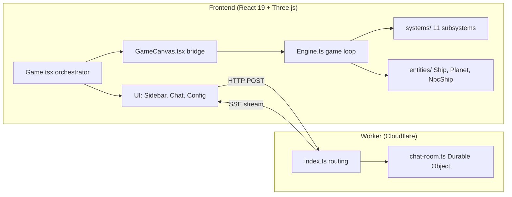
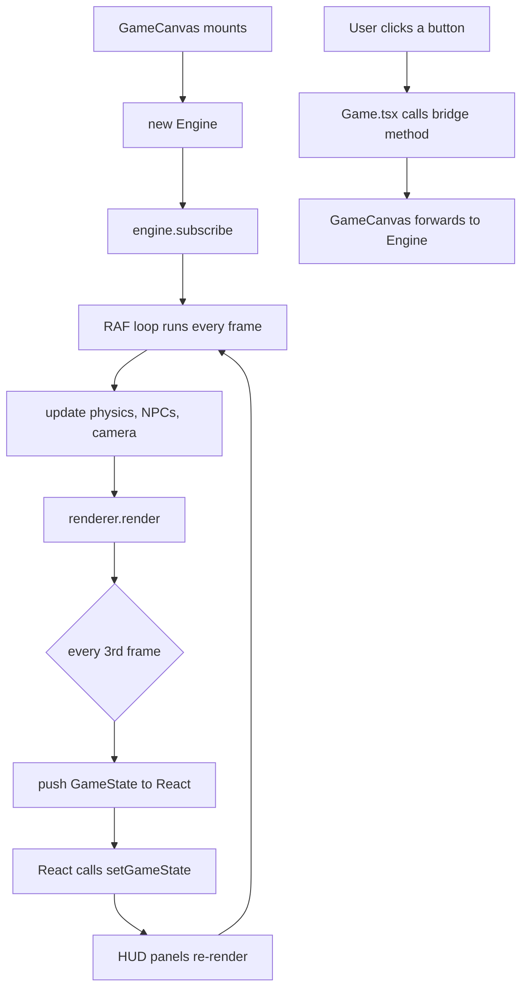
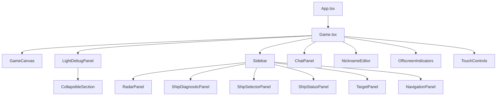
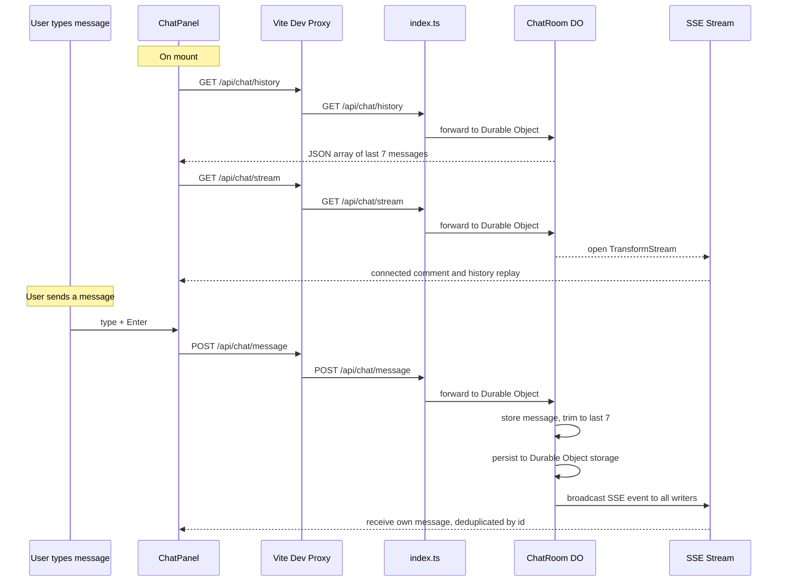

# Architecture

This document is the centerpiece of the EV · 2090 documentation. It covers the high-level structure, the critical React-Engine boundary, and the data flows that tie everything together.

## High-level overview

The project is split into two deployable units: a Vite-powered React frontend and a Cloudflare Worker backend. They communicate over HTTP (POST for sending chat messages, SSE for streaming them back)...



---

## The React-Engine boundary

This is the single most important architectural concept in the project. The engine (Three.js) and React live in completely separate worlds. They never import each other. The bridge between them is the `GameCanvasHandle` interface, exposed via React's `useImperativeHandle`.

**How it works:**

1. `Game.tsx` renders `<GameCanvas ref={canvasRef} />`.
2. Inside `GameCanvas`, a `useEffect` creates a new `Engine` instance and calls `engine.subscribe(onStateUpdate)`.
3. The engine runs its own `requestAnimationFrame` loop. Every 3rd frame (~20 fps), it calls the subscribe callback with a fresh `GameState` snapshot.
4. `GameCanvas` forwards that snapshot to `Game.tsx` via the `onStateUpdate` prop, which calls `setGameState(state)`.
5. React re-renders the HUD panels with the new data.
6. When the user clicks a button (change ship, jump back, etc.), `Game.tsx` calls methods on `canvasRef.current` -- the imperative handle. Those methods forward directly to the engine.



---

## GameCanvasHandle -- the bridge API

This is the **only** way React sends commands to the engine. Every method on this interface maps one-to-one to an `Engine` method. The handle is defined in `GameCanvas.tsx` via `useImperativeHandle`.

### Ship commands

| Method | Description |
|--------|-------------|
| `changeShip(shipId: string)` | Swap to a different ship model (preserves position and velocity) |
| `changeShipColor(color: ShipColor)` | Change the ship's texture color |
| `jumpBack()` | Teleport to the nearest planet |
| `setSidebarWidthPx(px: number)` | Tell the engine the sidebar pixel width so the camera centers the ship in the playable area |

### Camera commands

| Method | Description |
|--------|-------------|
| `setZoom(factor: number)` | Set camera zoom level |
| `getZoom(): number` | Read current zoom |
| `setCameraOffset(x, y)` | Set manual camera offset |
| `getCameraOffset(): { x, y }` | Read current camera offset |

### Debug commands

| Method | Description |
|--------|-------------|
| `setDebugView(view: DebugView)` | Switch camera mode: `"normal"`, `"top"`, or `"orbit"` |
| `getDebugView(): DebugView` | Read current camera mode |
| `setBeamVisible(visible: boolean)` | Show or hide the scan beam line |
| `isBeamVisible(): boolean` | Check scan beam visibility |
| `spawnTestShip()` | Spawn a frozen NPC near the player |
| `spawnTestRing()` | Spawn 4 test ships in a ring around the player |
| `clearTestShips()` | Remove all test ships (IDs starting with `"test-"`) |
| `onReady(cb: () => void)` | Register a callback fired ~800ms after engine mount |

### Config queries

| Method | Description |
|--------|-------------|
| `getLightConfig(): LightConfig \| null` | Read current lighting setup for the debug panel |
| `updateLight(lightName, property, value)` | Tweak a light property in real time |
| `updateShipMaterial(property, value)` | Tweak ship material properties (metalness, roughness, emissive) |

---

## Engine internals overview

The `Engine` constructor creates the Three.js scene and wires up all subsystems. Everything is instantiated in the constructor and disposed together in `dispose()`.

```mermaid
graph TB
    Engine["Engine.ts"] --> Renderer["WebGLRenderer"]
    Engine --> Scene["THREE.Scene"]
    Engine --> CC["CameraController"]
    Engine --> Input["InputManager"]
    Engine --> Star["Starfield"]
    Engine --> Neb["NebulaBg"]
    Engine --> Ship["Ship (player)"]
    Engine --> Planets["Planet[] (4)"]
    Engine --> Light["LightingSetup"]
    Engine --> NPC["NpcManager"]
    Engine --> Beam["DebugBeam"]
    Engine --> Orbit["OrbitControls"]
    Engine --> Sound["SoundManager"]
    Engine --> Models["ModelCache"]
    Engine --> PlanetTex["PlanetTextureGen"]
```



### The four planets

The solar system contains four procedurally-textured planets created in the constructor:

| Name   | Radius | Texture style | Atmosphere color |
|--------|--------|--------------|-----------------|
| Nexara | 6      | Earth (image) | Blue-teal |
| Velkar | 4      | Mars (generated) | Orange-red |
| Zephyra | 9     | Neptune (generated) | Light blue |
| Arctis | 2      | Luna (generated) | Grey |

---

## Game loop order

The engine loop runs every `requestAnimationFrame`. The exact order of operations in `Engine.loop()` is:

1. **Compute delta time** -- clamped to 50ms max to prevent physics explosions after tab-away
2. **FPS counter** -- updates once per second
3. **Ship update** -- apply thrust, rotation, velocity from `InputManager` state
4. **Planet update** -- rotate each planet mesh
5. **NPC update** -- scanner detection, spawning, removal via `NpcManager`
6. **Debug beam update** -- reposition the scan line visual if visible
7. **Thruster sound** -- start/stop the thruster audio loop based on thrust state
8. **Camera target** -- point the camera at the player ship position
9. **Orbit tracking** -- if in orbit debug view, track the locked NPC or player
10. **Camera update** -- interpolate camera position and apply offsets
11. **Starfield update** -- reposition star particles relative to camera
12. **Nebula update** -- keep the nebula background centered on camera
13. **Render** -- `renderer.render(scene, camera)`
14. **State push** -- every 3rd frame, call `onStateUpdate(getGameState())`

---

## React component tree

`Game.tsx` is the orchestrator. It holds `gameState` and passes slices of it down to each panel. No panel talks to the engine directly -- everything flows through `Game.tsx` callbacks.



**Responsive behavior:**

- **Desktop** (`>1024px`): Sidebar always visible (240px), chat + nickname + jump button shown
- **iPad/Tablet** (`768-1024px`): Sidebar always visible (200px), chat + nickname shown
- **Mobile** (`<768px`): No sidebar -- hamburger menu opens a modal with `ShipDiagnosticPanel`, mini radar HUD in corner, touch controls overlay

---

## SSE chat data flow

The chat system uses Server-Sent Events for real-time message delivery. The `ChatPanel` component manages the connection.



**Key details:**

- In development, Vite proxies `/api/chat/*` to `https://ws.ev2090.com` (configured in `vite.config.ts`). The proxy is specially configured to flush SSE chunks immediately.
- In production, the frontend hits `https://ws.ev2090.com/api/chat/*` directly.
- The `VITE_CHAT_API_URL` env var can override both of these for testing.
- The ChatPanel deduplicates messages by `id` and keeps only the last 7 visible.
- If the SSE connection drops, the ChatPanel auto-reconnects after 3 seconds.

---

## Type system

All data flowing from the engine to React passes through a single type: `GameState`, defined in `frontend/src/types/game.ts`.

```typescript
interface GameState {
  ship: ShipState;          // position, velocity, rotation, thrust, shields, armor, fuel
  navigation: NavigationInfo; // system name, coordinates, nearest planet
  target: TargetInfo;       // currently null (future: locked target data)
  radarContacts: RadarContact[]; // planets + NPC ships for the radar panel
  fps: number;              // frames per second
  currentShipId: string;    // active ship model id
  currentShipColor: ShipColor; // active texture color
}
```

Every HUD panel reads from `GameState`. The engine builds a fresh snapshot every 3rd frame inside `getGameState()`. This is the only data contract between the two worlds.
