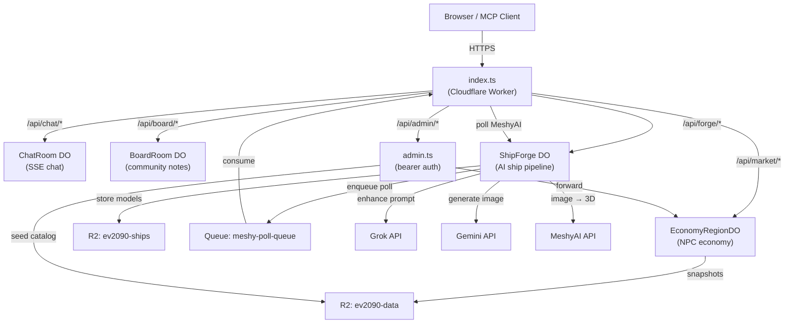

[← Back to index](/README.md)

# Backend Guide

> The entire EV 2090 backend is a single Cloudflare Worker deployment.
> One `index.ts` router, four Durable Objects, two R2 buckets, one queue.
> Once you understand the pattern in one Durable Object, you understand
> all four. The router is just a prefix switch. The DOs are just state
> machines with `fetch()`. It's simpler than it looks.

---

## How It Works (30-Second Version)

```
Browser request
    │
    ▼
index.ts (router)
    │
    ├─ /api/chat/*    → ChatRoom DO        (SSE real-time chat)
    ├─ /api/board/*   → BoardRoom DO       (community notes)
    ├─ /api/forge/*   → ShipForge DO       (AI ship pipeline)
    ├─ /api/market/*  → EconomyRegionDO    (NPC economy engine)
    ├─ /api/admin/*   → admin.ts handlers  (auth required)
    └─ /               → health check JSON
```

Every request goes through CORS validation (not wildcard -- real origin checking). Every Durable Object has exactly one global instance. The economy ticks every 60 seconds via alarm. Ships get built via a queue. Chat streams via SSE. Notes are just key-value storage.

---

## Architecture at a Glance



---

## The Durable Object Pattern

Every Durable Object in this codebase follows the same lifecycle:

1. **Constructor** -- load persisted state into memory
2. **`fetch()`** -- route requests, read/write in-memory state
3. **`alarm()`** -- periodic background work (pings, ticks)
4. **Cloudflare manages disposal** -- no `dispose()` needed

The only variation is persistence strategy:

| DO | Storage | Why |
|----|---------|-----|
| ChatRoom | KV (`state.storage.get/put`) | Simple -- just 7 messages |
| BoardRoom | KV (`state.storage.list/put`) | Prefix-scannable per planet |
| ShipForge | KV (`state.storage.get/put`) | Jobs + catalog, variable schema |
| EconomyRegionDO | SQLite (`ctx.storage.sql`) | 7 tables, indexes, aggregation queries |

KV storage is Cloudflare's built-in Durable Object key-value store (not Workers KV -- this is per-DO embedded storage). SQLite is Cloudflare's newer option for DOs that need relational queries.

---

## index.ts -- The Router

**File:** `worker/src/index.ts`

### Route Families

| Prefix | Target | Instance Name | Purpose |
|--------|--------|---------------|---------|
| `/api/chat/*` | `ChatRoom` DO | `"global"` | Real-time SSE chat |
| `/api/board/*` | `BoardRoom` DO | `"global"` | Community planet notes |
| `/api/forge/*` | `ShipForge` DO | `"global"` | AI ship generation |
| `/api/market/*` | `EconomyRegionDO` | `"core-worlds"` | NPC economy simulation |
| `/api/admin/*` | `admin.ts` handlers | -- | Authenticated admin endpoints |
| `/` | Inline JSON | -- | Health check + version |

Every route family strips its prefix, forwards the clean path to the DO, and applies CORS on the response. Query parameters are preserved. The DO receives paths like `/stream`, `/message`, `/catalog` without the `/api/chat` prefix.

### CORS

CORS is handled at the router level by `cors.ts`, **not** inside each DO. `applyCors()` validates the origin against an allowlist and replaces any `*` headers with the validated origin.

### Queue Consumer

The queue consumer handles MeshyAI polling for the Ship Forge pipeline. See [forge-guide.md](./forge-guide.md) for details.

### Health Check

`GET /` returns `{ service, version, status: "ok" }`.

---

## ChatRoom (`chat-room.ts`)

Real-time chat using Server-Sent Events (SSE). The simplest DO.

**Instance:** One global (`"global"`).

**How it works:**

1. Client connects to `GET /stream` -- opens an SSE stream
2. Server sends history (last 7 messages) immediately
3. New messages arrive via `POST /message`
4. Server broadcasts to all connected writers
5. Alarm pings every 15 seconds to keep connections alive

**Storage:** KV -- a single key `"messages"` holding the last 7 `ChatMessage` objects.

**Routes:**

| Method | Path | Purpose |
|--------|------|---------|
| GET | `/stream` | Open SSE connection, receive history + live messages |
| POST | `/message` | Send a message (nickname + text) |
| GET | `/history` | Fetch current messages as JSON array |

**Limits:** 7 messages max, 15s ping interval, 16-char nicknames, 200-char messages.

**SSE implementation:** Each connected client gets a `TransformStream` writer stored in a `Set`. The readable side is the response body. Dead writers (closed connections) are cleaned up during broadcast.

**Why SSE instead of WebSockets?** SSE is simpler, works through CDNs, and chat is one-directional (server pushes, client POSTs).

---

## BoardRoom (`board-room.ts`)

Community notes at planet stations. Players dock, leave a short message, others read it.

**Instance:** One global (`"global"`).

**Storage:** KV with key pattern `note:{planet}:{paddedTimestamp}:{uuid}`. Timestamp is zero-padded so `list()` with `reverse: true` gives newest-first ordering.

**Routes:**

| Method | Path | Params | Purpose |
|--------|------|--------|---------|
| GET | `/notes` | `?planet=velkar&limit=20` | Fetch notes for a planet |
| POST | `/notes` | Body: `{ planet, nickname, text }` | Post a new note |

**Limits:** 100 notes per planet (oldest pruned), 280-char text, 10-word max, 16-char nicknames.

**No alarm, no SSE.** Purely request-driven. Frontend polls on dock.

---

## ShipForge (`ship-forge.ts`)

The most complex DO. An AI-powered pipeline that turns a text prompt into a 3D spaceship model. This DO has its own dedicated documentation:

**→ [Ship Forge Guide](./forge-guide.md)** -- pipeline diagram, state machine, routes, rate limiting, external APIs, R2 assets.

---

## EconomyRegionDO (`economy-region.ts`)

The NPC-driven economy engine. This is the biggest DO -- it simulates production, consumption, trade routes, disruptions, and price curves for every commodity on every planet, 24/7. This DO has its own dedicated documentation:

- **[Economy Engine](./economy-engine.md)** -- tick lifecycle, SQLite schema, warmup, price curves
- **[NPC Economy](./npc-economy.md)** -- NPC brain (6 rules), sawtooth patterns, route design, tuning constants

**Instance:** One per region (`"core-worlds"` -- 4 planets, 20 commodities).

**Storage:** SQLite with 7 tables.

**Alarm:** 60-second tick cycle.

---

## Admin API (`admin.ts`)

**File:** `worker/src/admin.ts`

All admin routes require `Authorization: Bearer {ADMIN_API_KEY}`. The router calls `requireAdminAuth()` before forwarding to `handleAdminRoute()`.

### Endpoints

| Method | Path | Purpose |
|--------|------|---------|
| GET | `/api/admin/commodities` | Full commodity catalog |
| GET | `/api/admin/economy/regions` | Summary of all economy regions |
| GET | `/api/admin/economy/region/{id}` | Full market state for a region |
| GET | `/api/admin/economy/region/{id}/history` | Price history |
| GET | `/api/admin/economy/region/{id}/history/enriched` | History with trade events + disruptions |
| GET | `/api/admin/economy/region/{id}/trade-events` | NPC trade event log |
| GET | `/api/admin/economy/region/{id}/ticks` | Tick execution stats |
| POST | `/api/admin/economy/region/{id}/disrupt` | Trigger a market disruption |
| POST | `/api/admin/economy/region/{id}/warmup` | Run economy warmup |
| GET | `/api/admin/economy/region/{id}/diagnostics` | Deep diagnostic dump |
| GET | `/api/admin/infra/health` | Infrastructure health check |
| POST | `/api/admin/seed` | One-time setup: commodity catalog to R2 + warmup |

Most endpoints are thin wrappers that forward to the EconomyRegionDO. The admin layer adds auth, routes by region ID, and returns 502 if the DO is unreachable.

**Tick health levels:** `ok` (within 2 min), `delayed` (2-3 min ago), `stopped` (>3 min or warmup incomplete).

---

## CORS (`cors.ts`)

**File:** `worker/src/cors.ts`

CORS is not `*`. Every response is validated against an allowlist of known origins.

### Allowed Origins

| Pattern | Example |
|---------|---------|
| `https://ev2090.com` | Production |
| `https://www.ev2090.com` | Production (www) |
| `https://admin.ev2090.com` | Admin dashboard (internal only — not hardened) |
| `http://localhost:{port}` | Any localhost port (dev) |
| `https://{hash}.ev2090.pages.dev` | Cloudflare Pages previews |

Localhost and Pages preview patterns are handled by regex. Preflight responses cache for 24 hours.

---

## R2 Buckets

### `ev2090-ships` (binding: `SHIP_MODELS`)

Community ship assets from the Ship Forge. See [forge-guide.md](./forge-guide.md) for key patterns.

### `ev2090-data` (binding: `STATIC_DATA`)

Economy data published by the EconomyRegionDO:

| Key | Content | Frequency |
|-----|---------|-----------|
| `market/regions/core-worlds.json` | Full market snapshot | Every 5 minutes |
| `market/commodities.json` | Commodity catalog | One-time setup |

The frontend reads market snapshots from R2 via CDN -- no Worker hit for price display.

---

## Source Files

| File | Purpose |
|------|---------|
| `worker/src/index.ts` | Router + queue consumer |
| `worker/src/cors.ts` | CORS origin validation |
| `worker/src/admin.ts` | Admin API handlers (auth + forwarding) |
| `worker/src/chat-room.ts` | ChatRoom DO (SSE chat) |
| `worker/src/board-room.ts` | BoardRoom DO (community notes) |
| `worker/src/ship-forge.ts` | ShipForge DO (AI ship pipeline) |
| `worker/src/economy-region.ts` | EconomyRegionDO (NPC economy engine) |
| `worker/src/economy/pricing.ts` | Sigmoid price curve + external exports |
| `worker/src/economy/trade-routes.ts` | NPC brain -- 6-rule decision engine |
| `worker/src/economy/disruptions.ts` | Disruption modifiers |
| `worker/src/data/commodities.ts` | 20 commodity definitions |
| `worker/src/data/planet-economies.ts` | 4 planet + 1 region definition |
| `worker/src/types/economy.ts` | TypeScript types for economy structures |

---

## Related Docs

- **[forge-guide.md](./forge-guide.md)** -- Ship Forge pipeline, state machine, routes, APIs
- **[economy-engine.md](./economy-engine.md)** -- Tick lifecycle, SQLite schema, price curves
- **[npc-economy.md](./npc-economy.md)** -- NPC decision brain, sawtooth patterns, route design
- **[mcp-guide.md](./mcp-guide.md)** -- AI-assisted economy management (37 tools)
- **[cloudflare-setup.md](./cloudflare-setup.md)** -- Deployment, secrets, wrangler.toml configuration
- **[recipes.md](./recipes.md)** -- How to add a new DO, admin endpoint, or route family
