[← Back to index](/README.md)

# Ship Forge Guide

The Ship Forge is an AI-powered pipeline that turns a text prompt into a 3D spaceship model. Three external AI services, a Cloudflare Queue, R2 storage, rate limiting, and content moderation -- all orchestrated by a single Durable Object.

---

## Pipeline Overview

```mermaid
graph LR
    User["Player describes ship"] --> Lore["Grok<br/>name + lore + moderation"]
    Lore --> Grok["Grok<br/>structural spec"]
    Grok --> Gemini1["Gemini pass 1<br/>blueprint image"]
    Gemini1 --> Approve["Player approves<br/>+ picks colors"]
    Approve --> Gemini2["Gemini pass 2<br/>colored render"]
    Gemini2 --> Meshy["MeshyAI<br/>image → 3D GLB"]
    Meshy --> R2["R2 storage<br/>model + thumbnail"]
    R2 --> Catalog["Ship catalog"]
```

The pipeline has six stages, each producing an artifact that feeds the next. The player sees and approves key outputs (blueprint, colored render) before the expensive 3D generation step.

---

## State Machine

Every forge job moves through these states:

| Status | Meaning | Next |
|--------|---------|------|
| `concept_loading` | Grok enhancing prompt, Gemini generating blueprint | `blueprint_ready` |
| `blueprint_ready` | Blueprint image ready for player review | `render_loading` |
| `render_loading` | Gemini pass 2: colored render from blueprint + colors | `concept_ready` |
| `concept_ready` | Colored concept ready, player can approve for 3D | `building_3d` |
| `building_3d` | MeshyAI converting image to GLB (1-2 minutes) | `succeeded` or `failed` |
| `succeeded` | Ship complete and in catalog | Terminal |
| `failed` | Something broke | Terminal |

---

## Architecture

**Durable Object:** `ShipForge` in `worker/src/ship-forge.ts`

**Instance:** One global instance (`"global"`).

**Storage:** KV with three key patterns:

| Pattern | Value | Purpose |
|---------|-------|---------|
| `job:{jobId}` | `ForgeJob` | In-flight generation state |
| `ship:{paddedTimestamp}:{shipId}` | `CommunityShipMeta` | Completed ship catalog entry |
| `rate:{fingerprint}:{YYYY-MM-DD}` | `number` | Daily generation count |

### Queue Integration

When `generate-3d` starts a MeshyAI job, it enqueues a poll message to `MESHY_QUEUE`. The queue consumer in `index.ts` polls every 10 seconds, forwarding results back into the DO via `POST /poll`. Maximum 60 attempts (10 minutes). On success, the DO downloads the GLB + thumbnail, stores them in R2, and creates a catalog entry.

Why a queue instead of a DO alarm? MeshyAI jobs take minutes. Tying up a DO alarm for polling would block other alarm-driven work. The queue gives backpressure, retries, and concurrency limits for free.

---

## Routes

### Public Routes (gated by `FORGE_LOCKED`)

| Method | Path | Purpose |
|--------|------|---------|
| GET | `/config` | Is creation locked? (always open) |
| POST | `/process-lore` | Grok moderation + lore auto-complete (always open) |
| POST | `/generate-concept` | Start pipeline: Grok spec → Gemini blueprint |
| POST | `/generate-render` | Gemini pass 2: blueprint + colors → colored render |
| POST | `/generate-3d` | Approve concept → MeshyAI 3D generation |
| GET | `/status/{jobId}` | Poll job status |
| GET | `/catalog` | Browse completed ships |
| GET | `/asset/*` | Serve R2 files (images, models) |

### Admin Routes (require `FORGE_API_KEY`)

| Method | Path | Purpose |
|--------|------|---------|
| DELETE | `/ship/{shipId}` | Remove ship from catalog + R2 |
| PATCH | `/ship/{shipId}/lore` | Regenerate ship lore via Grok |
| PATCH | `/ship/{shipId}/hero` | Generate hero banner image |
| GET | `/ship/{shipId}/hero/status` | Poll hero generation progress |
| POST | `/ship/{shipId}/hero/approve` | Approve hero draft |
| POST | `/seed-builtins` | Seed DO with built-in ship metadata |
| POST | `/admin/migrate-images` | Convert PNGs to JPEG in R2 |

---

## External APIs

| Service | Model | Purpose |
|---------|-------|---------|
| Grok (x.ai) | `grok-4-1-fast-non-reasoning` | Prompt enhancement, lore, content moderation |
| Gemini (Google) | `gemini-3.1-flash-image-preview` | Blueprint (pass 1) + colored render (pass 2) |
| MeshyAI | Image-to-3D v2 | Convert 2D concept art to GLB 3D model |
| Cloudflare Images | -- | PNG → JPEG conversion for smaller assets |

---

## R2 Assets

All forge assets live in the `ev2090-ships` R2 bucket:

| Key Pattern | Content |
|-------------|---------|
| `{shipId}/model.glb` | 3D GLB model |
| `{shipId}/thumbnail.jpg` | Ship thumbnail |
| `{shipId}/concept.jpg` | Colored concept art |
| `{shipId}/blueprint.jpg` | Blueprint image |
| `{shipId}/hero.jpg` | Cinematic hero banner |

Images are converted to JPEG via Cloudflare Images before storage. Assets are served through `GET /api/forge/asset/{key}` with `Cache-Control` headers.

---

## Rate Limiting and Feature Flag

**Rate Limiting:** IP-based fingerprint (SHA-256 hashed with salt), tracked per day. Default limit: 100 generations per fingerprint per day.

**Feature Flag:** `FORGE_LOCKED` (set in `wrangler.toml` vars). When `"true"`, creation endpoints return 403 but the catalog and config endpoints remain open. The admin API key bypasses the lock.

---

## Key Constants

| Constant | Value | Purpose |
|----------|-------|---------|
| `MAX_DAILY_GENERATIONS` | 100 | Per-fingerprint daily limit |
| `MAX_PROMPT_LENGTH` | 200 | User prompt character limit |
| `MAX_NAME_LENGTH` | 30 | Ship name character limit |
| `MAX_CATALOG_SHIPS` | 200 | Total catalog size limit |
| `CDN_BASE` | `https://ws.ev2090.com/api/forge/asset` | Public asset URL prefix |

---

## Community Ships in the Frontend

Community ships differ from built-in ships:

- `source: "community"` identifies them as forge-generated
- Use embedded PBR materials in GLB format -- no separate texture files
- Have no color variants (always use embedded materials)
- Include `thumbnailUrl`, `heroUrl`, `creator`, and `prompt` metadata
- MeshyAI-generated GLBs have heavy normal maps reduced to `normalScale 0.35` for a cleaner look

The frontend loads the forge catalog via `GET /api/forge/catalog` and merges community ships into `ShipCatalog.ts` alongside the 11 built-in ships.

---

## Related Docs

- **[backend-guide.md](./backend-guide.md)** -- Game worker architecture, other Durable Objects
- **[engine-guide.md](./engine-guide.md)** -- ShipCatalog, Ship entity, model loading
- **[mcp-guide.md](./mcp-guide.md)** -- MCP tools for managing forge ships (`list_ships`, `inspect_ship`, `delete_ship`)
- **[cloudflare-setup.md](./cloudflare-setup.md)** -- Setting up external API keys for the forge pipeline
