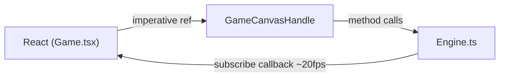

# Welcome to EV · 2090

Hey -- don't be concerned. This project might look big at first glance, but it is built on a small number of repeating patterns. This guide will help you understand and play with every part of it. Take your time, and start with whatever interests you most.

## What is this?

EV · 2090 is a 3D space simulation built with **React 19** for UI, **Three.js** for the 3D world, and a **Cloudflare Worker** for multiplayer chat. You fly a ship around a solar system, scan NPC vessels, swap between ship models and colors, and chat with other players in real time.

The codebase is roughly 40 source files across two workspaces (`frontend/` and `worker/`). This project looks like a lot of files, but the structure is surprisingly regular. Every system follows the same pattern. Once you understand one, you understand them all.

## See it running

From the project root:

```bash
npm install && npm run dev
```

Open [http://localhost:5180](http://localhost:5180) in your browser.

**Controls:**

| Key             | Action  |
|-----------------|---------|
| W / Arrow Up    | Thrust  |
| A / Arrow Left  | Rotate left  |
| D / Arrow Right | Rotate right |
| S / Arrow Down  | Brake   |
| B               | Toggle debug beam |

**Console tricks** -- open your browser dev tools and try:

- `config()` -- toggles the light/camera debug panel
- `testship()` -- spawns a frozen NPC near your ship for testing

## How to read these docs

You do not need to read everything. Pick the guide that matches what you are working on.

1. **This page** (you are here) -- project overview and orientation
2. **[architecture.md](./architecture.md)** -- big picture, key diagrams, data flow
3. **[engine-guide.md](./engine-guide.md)** -- if you will touch the 3D layer (Three.js, systems, entities)
4. **[ui-guide.md](./ui-guide.md)** -- if you will touch React components (sidebar, HUD, chat)
5. **[backend-guide.md](./backend-guide.md)** -- if you will touch the worker/chat backend

Start with [architecture.md](./architecture.md) for the big picture, then jump to whichever guide covers your area.

## Project layout at a glance

The project is organized as two npm workspaces managed from the root `package.json`:

| Directory              | Purpose |
|------------------------|---------|
| `frontend/src/engine/` | Three.js game engine -- systems, entities, shaders, the main loop |
| `frontend/src/components/` | React UI -- sidebar panels, chat, HUD overlays, config tools |
| `frontend/src/types/`  | Shared TypeScript types (the `GameState` contract lives here) |
| `frontend/src/hooks/`  | Custom React hooks (`useBreakpoint`, `useConfigSlider`) |
| `worker/src/`          | Cloudflare Worker -- HTTP routing and the ChatRoom Durable Object |

## The one rule that governs everything

> **The engine has zero React dependencies. React talks to the engine through an imperative ref handle (`GameCanvasHandle`). The engine pushes state back to React at ~20 fps via a subscribe callback. This boundary is the single most important thing to understand.**

The flow looks like this:



React never reaches into Three.js objects directly. The engine never imports React. `GameCanvasHandle` is the contract between the two worlds. If you remember nothing else from these docs, remember this.

## Using AI assistants?

Do you use Claude Code, Cursor, or another AI coding assistant? I've prepared context files to help your AI understand this codebase instantly:

- **`CLAUDE.md`** at the project root -- context for Claude Code / Claude
- **`.cursorrules`** at the project root -- context for Cursor
- **[docs/ai.md](./ai.md)** -- explains what these files contain, why every rule exists, and tips for getting the best results

Point your assistant at these files and it will have a head start on the architecture, naming conventions, and key patterns used throughout the project.

## Reference docs

For detailed reference tables of every system and component, see the in-tree README files:

- [`frontend/src/engine/README.md`](../frontend/src/engine/README.md) -- engine systems and entities reference
- [`frontend/src/components/README.md`](../frontend/src/components/README.md) -- React component reference

The `docs/` guides explain the **why**. The in-tree READMEs explain the **what**.
